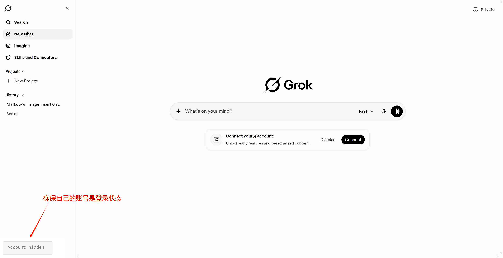
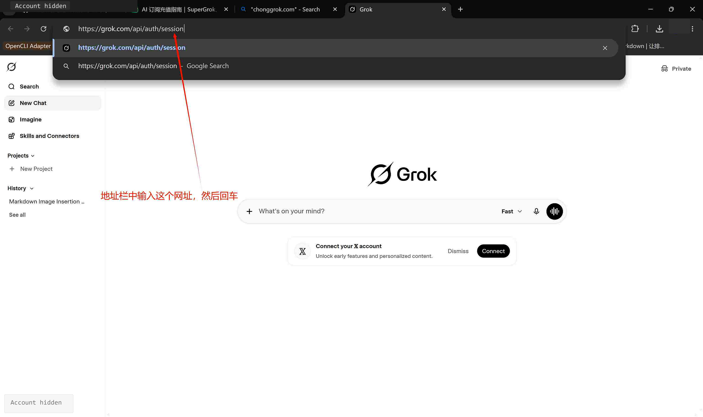
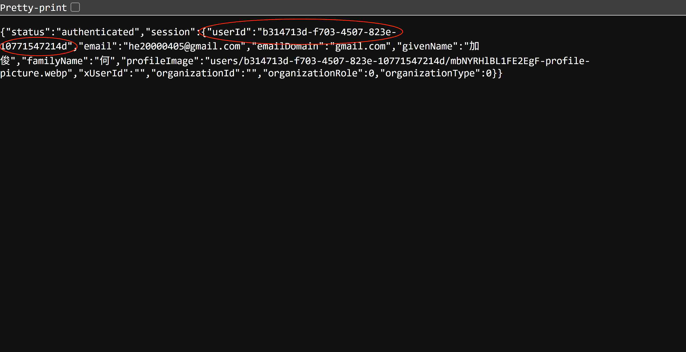
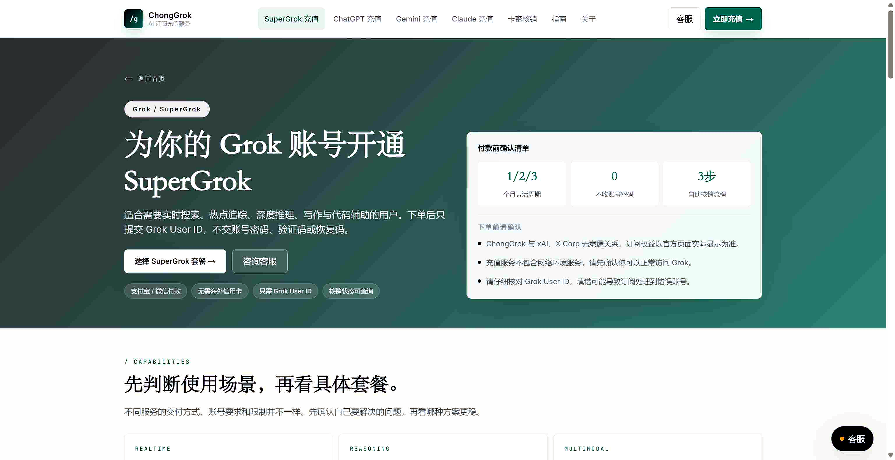
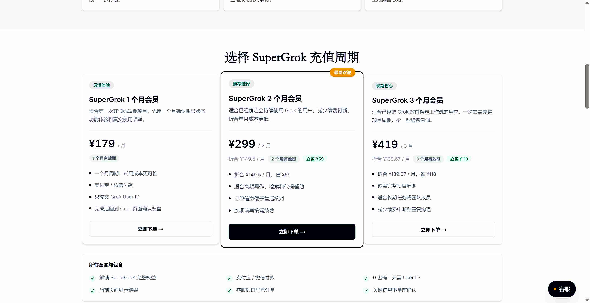
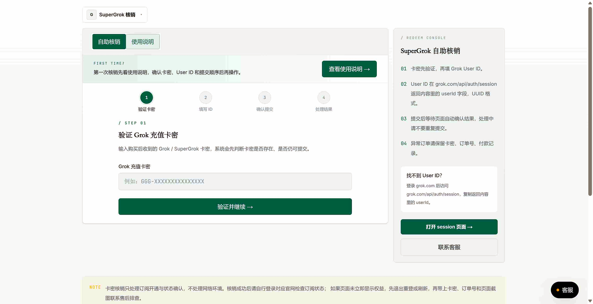

# Grok / SuperGrok 国内开通指南：套餐选择、User ID、付款失败与 chonggrok.com 代充说明

> 最后更新：2026-07-09  
> 适用对象：国内想开通 Grok / SuperGrok，但没有可用境外信用卡，或遇到 `Your credit card was declined`、`unable to authenticate payment` 等付款问题的用户。  
> 重要提示：Grok、SuperGrok、X Premium+ 的官方价格、权益、额度和入口可能随时调整，下单或决策前请以 [grok.com/plans](https://grok.com/plans) 与账号内实际显示为准。

## TL;DR：先看结论

- 只想用 Grok 本身做对话、检索、写作、代码辅助、生图，优先看 **SuperGrok**。
- 如果你每天重度使用 X，并且需要 X 平台会员权益，再考虑 **X Premium+**。
- 国内用户常见卡点不是“选哪档”，而是官网支付阶段：境外卡、3D Secure、账单地址、风控都可能导致失败。
- 如果不想折腾外币卡，可以把 **chonggrok.com** 作为一个可选方案：用支付宝/微信付款，按页面提示提交 Grok User ID，不需要提交登录密码，由服务方用境外卡完成 xAI 官方付款升级。
- 任何线上服务都不是零风险。更可信的口径是：不碰密码、账号归你、凭证仅用于本次升级、权益以官方页面为准。

**English summary:** SuperGrok is usually the direct choice if you mainly use Grok itself. X Premium+ is more relevant if X is your main platform. For mainland China users, payment is often the blocker. chonggrok.com is a no-password top-up option: you submit the Grok User ID, not your password, and the upgrade is paid through the official xAI subscription flow.

## 目录

- [一、Grok、SuperGrok、X Premium+ 是什么](#一grok-supergrok-x-premium-是什么)
- [二、SuperGrok 和 X Premium+ 怎么选](#二supergrok-和-x-premium-怎么选)
- [三、国内开通 SuperGrok 为什么容易付款失败](#三国内开通-supergrok-为什么容易付款失败)
- [四、国内用户的几种开通方式对比](#四国内用户的几种开通方式对比)
- [五、代充、共用账号和现成账号有什么区别](#五代充共用账号和现成账号有什么区别)
- [六、Grok User ID 怎么找](#六grok-user-id-怎么找)
- [七、SuperGrok 充值前安全检查清单](#七supergrok-充值前安全检查清单)
- [八、常见付款与登录报错排查](#八常见付款与登录报错排查)
- [九、用 chonggrok.com 开通 SuperGrok 的流程](#九用-chonggrokcom-开通-supergrok-的流程)
- [十、FAQ](#十faq)
- [十一、英文摘要](#十一英文摘要)
- [十二、参考资料](#十二参考资料)

## 一、Grok、SuperGrok、X Premium+ 是什么

**Grok** 是 xAI 提供的 AI 助手，可在 grok.com、X 平台及相关 App 中使用。国内用户搜索“Grok 会员”“SuperGrok 充值”“Grok 付款失败”时，常见的是两条订阅线：

| 名称                 | 入口         | 核心定位                       | 适合谁                         |
| -------------------- | ------------ | ------------------------------ | ------------------------------ |
| Grok Free            | grok.com / X | 免费体验，额度和能力有限       | 偶尔尝鲜、先测试账号           |
| SuperGrok            | grok.com     | 围绕 Grok 本身的付费订阅       | 主要使用 Grok 做生产力工具的人 |
| X Premium / Premium+ | X 平台       | X 平台会员权益 + Grok 相关权益 | 重度使用 X 的用户、创作者      |

**定义：SuperGrok**  
SuperGrok 是 xAI 在 grok.com 提供的 Grok 独立付费订阅。它更适合把 Grok 当作主要 AI 工具的人。具体权益、额度和价格以官方页面实时显示为准。

**Definition: SuperGrok**  
SuperGrok is xAI's standalone paid Grok subscription on grok.com. It is generally the more direct option if you mainly want Grok itself, while X Premium+ is more relevant for users who also need X platform benefits.

## 二、SuperGrok 和 X Premium+ 怎么选

先按使用场景判断，不要只看关键词下单。

| 判断问题       | 更适合 SuperGrok                        | 更适合 X Premium+             |
| -------------- | --------------------------------------- | ----------------------------- |
| 主要入口       | grok.com                                | X App / X 网页                |
| 主要需求       | Grok 对话、搜索、写作、代码辅助、多模态 | X 会员权益 + Grok             |
| 是否重度使用 X | 不一定                                  | 是                            |
| 购买前验收     | 看 Grok 订阅和功能状态                  | 同时看 X 会员状态与 Grok 权益 |
| 决策建议       | 只用 Grok，优先看它                     | X 是主战场，再考虑它          |

建议：

- 只想用 Grok：优先看 SuperGrok。
- 已经长期运营 X，且需要 X 的会员展示、发布、浏览或创作者相关权益：再考虑 X Premium+。
- 已经买错或不确定：先确认当前订单、账号、订阅入口和权益状态，不要重复下单。

## 三、国内开通 SuperGrok 为什么容易付款失败

国内用户在官方页面开通 Grok / SuperGrok 时，常见阻力通常来自支付链路：

- 发卡行不支持境外线上订阅扣款；
- 支付页面需要 3D Secure 或银行验证，但验证失败；
- 账单地址、卡片地区、账号地区或网络环境触发风控；
- 虚拟卡、低质量卡段、重复尝试导致支付被拒；
- 用户在 grok.com、X App、iOS、Google Play 等不同入口之间混淆订阅状态。

常见英文报错包括：

- `Your credit card was declined`
- `unable to authenticate payment`
- `payment failed`
- `card declined`
- 支付成功后仍显示 Free / 额度未刷新
- 登录或 CLI 端提示订阅状态异常

这些问题不一定说明账号有问题，也不代表“再试几次就一定封号”。更合理的处理方式是先判断是哪一层出错：卡片、验证、账单地址、订阅入口、账号登录状态，还是官方权益同步延迟。

## 四、国内用户的几种开通方式对比

| 方式                           | 优点                      | 难点 / 风险                                    | 适合谁                 |
| ------------------------------ | ------------------------- | ---------------------------------------------- | ---------------------- |
| 自办境外信用卡或可用虚拟卡     | 自己掌控付款与续费        | 办卡门槛高，部分卡仍可能被拒                   | 有稳定境外支付能力的人 |
| 海外亲友代付                   | 真实境外卡，成功率相对高  | 依赖亲友，人情成本和续费沟通成本高             | 有靠谱海外亲友的人     |
| iOS / Google Play 等应用内购买 | 对部分用户更顺手          | 入口、价格、退款规则和权益同步可能不同         | 熟悉应用商店订阅的人   |
| 第三方代充                     | 支付宝/微信付款，省去办卡 | 需要选择不索要密码、流程清楚、售后可追溯的服务 | 不想折腾外币卡的人     |

如果选择第三方代充，重点不是看营销口号，而是看流程是否清楚：

- 是否明确不需要登录密码；
- 是否只要求本次升级所需的 Grok User ID；
- 是否说明订单、卡密、核销、售后处理规则；
- 是否承认线上服务非零风险；
- 是否明确只处理你自己的账号订阅，不引导多人共用或购买现成账号。

## 五、代充、共用账号和现成账号有什么区别

| 方式     | 账号归属     | 优点                                                 | 主要风险                                     |
| -------- | ------------ | ---------------------------------------------------- | -------------------------------------------- |
| 代充     | 你的账号     | 用自己的账号完成官方升级，历史记录和数据在自己账号里 | 需要提交本次升级所需的 User ID               |
| 拼车合租 | 多人共用账号 | 单价可能更低                                         | 隐私混杂、多人共用易异常、稳定性差           |
| 现成账号 | 卖家提供账号 | 到手可用                                             | 账号不属于你，可能被找回、封禁或无法长期使用 |

本文只讨论 Grok / SuperGrok 会员订阅开通，不建议把多人共用或现成账号当作长期方案。

chonggrok.com 的定位是：只做 ChatGPT、Grok、Claude、Gemini 四家会员订阅代充，不扩展到开发者计费、账号售卖或注册规避类业务。

## 六、Grok User ID 怎么找

Grok User ID 是 SuperGrok 直充时用于定位账号的标识。它不是密码，不能用来登录你的账号，但填错会影响订阅处理。

### 获取步骤

1. 打开 [https://grok.com](https://grok.com)，确认已经登录你要升级的 Grok 账号。

2. 在同一个浏览器里打开：`https://grok.com/api/auth/session`。

3. 如果已经登录，会看到一段 JSON 内容。
4. 找到 `userId` 字段，复制引号里的完整内容。

5. 粘贴前检查它是否是 UUID 格式，例如：`12345678-1234-1234-9234-123456789abc`。

### 提交前核对

- 复制的是 `userId`，不是邮箱、昵称、X 用户名、手机号、头像链接或 `xUserId`。
- 不要手打，不要截图识别，直接复制粘贴。
- 确认首尾没有漏字符，也没有多余空格。
- 如果 session 页面显示未登录，先回到 grok.com 重新登录。
- 如果找不到 `userId`，先暂停提交，联系客服或重新检查登录状态。

## 七、SuperGrok 充值前安全检查清单

下单前建议按这张清单逐项确认：

| 检查项   | 应该确认什么                                      |
| -------- | ------------------------------------------------- |
| 账号可用 | 你能正常登录 grok.com，且当前账号就是要升级的账号 |
| User ID  | 能从 `grok.com/api/auth/session` 找到 `userId`    |
| 格式     | User ID 是完整 UUID，包含横线，没有多余空格       |
| 密码     | 不向任何代充服务提交登录密码、验证码、恢复码      |
| 套餐     | 明确选择 1 个月、2 个月或 3 个月                  |
| 订单     | 保存订单号、卡密、支付时间和核销状态              |
| 售后     | 知道失败、超时、填错信息时如何联系和处理          |
| 风险     | 理解任何线上订阅服务都不是零风险                  |

风险信号：

- 要求你提供 Grok 登录密码、邮箱验证码或恢复码；
- 使用夸张安全承诺，把线上订阅说成完全没有风险；
- 不提供订单号、核销记录或可追溯售后信息；
- 引导你购买多人共用账号或现成账号；
- 让你反复提交不同 User ID 测试。

## 八、常见付款与登录报错排查

### `Your credit card was declined`

含义：银行卡被拒，常见于发卡行、卡段、境外订阅扣款权限或支付风控。

可尝试：

1. 换一张明确支持境外线上订阅的卡。
2. 检查余额、额度、有效期和 CVV。
3. 确认账单地址与开卡信息一致。
4. 避免短时间内对同一张卡反复提交。
5. 如果多张国内卡都失败，考虑使用其他开通方式。

### `unable to authenticate payment`

含义：支付验证失败，常见于 3D Secure、银行验证、地区权限或风控。

可尝试：

1. 按银行验证流程完成 3D Secure。
2. 确认卡片开启境外线上支付。
3. 换卡往往比反复重试更有效。
4. 检查是否使用了和付款地区冲突的账单信息。

### 支付成功但仍显示 Free

可能原因：

- 付款账号和当前登录账号不是同一个；
- 权益同步有延迟；
- 订阅入口不同，比如 X、grok.com、iOS、Google Play 混用；
- 浏览器会话没有刷新。

可尝试：

1. 退出 grok.com 后重新登录。
2. 确认付款账号和当前账号一致。
3. 等待几分钟后刷新订阅页。
4. 到 Settings / Billing 查看订阅状态。
5. 保存订单和支付凭证，必要时联系对应入口售后。

### Grok CLI 或开发者端提示订阅异常

先区分消费者会员订阅和开发者计费体系。本文只讨论 Grok / SuperGrok 会员订阅，不讨论开发者控制台相关充值。

可检查：

- 当前账号是否已经有有效 SuperGrok 或相关订阅；
- 登录的账号是否与订阅账号一致；
- CLI 或网页端的认证入口是否匹配；
- 网络环境是否导致登录会话异常；
- 官方服务是否有短时同步延迟。

## 九、用 chonggrok.com 开通 SuperGrok 的流程

如果你没有可用境外卡，或不想反复处理支付风控，可以把 chonggrok.com 作为一个可选的 SuperGrok 代充入口。

入口：

- SuperGrok 充值页：[https://chonggrok.com/supergrok](https://chonggrok.com/supergrok)
- 卡密核销页：[https://chonggrok.com/verify](https://chonggrok.com/verify)
- 主站：[https://chonggrok.com](https://chonggrok.com)

### 当前套餐参考

以下价格来自 chonggrok.com SuperGrok 页面，实际以下单页实时显示为准。

| 套餐             | 适合场景                                 | 参考价格 |
| ---------------- | ---------------------------------------- | -------- |
| SuperGrok 1 个月 | 首次体验、先验证账号和使用需求           | ¥179     |
| SuperGrok 2 个月 | 已经把 Grok 放进日常工作流，减少续费打断 | ¥299     |
| SuperGrok 3 个月 | 覆盖季度项目、论文阶段或长期任务         | ¥419     |

### 下单与核销流程

1. 打开 [https://chonggrok.com/supergrok](https://chonggrok.com/supergrok)，选择 1 / 2 / 3 个月套餐。

2. 使用支付宝或微信完成付款，保存订单号和卡密。
3. 打开 [https://chonggrok.com/verify](https://chonggrok.com/verify)，输入卡密。

4. 按页面提示提交 Grok User ID。
5. 等待处理完成后，回到 grok.com 检查订阅状态和权益。

### 为什么不需要密码

Grok 直充需要的是用于定位账号的 `userId`。它不是登录密码，也不能单独登录你的账号。

更稳妥的流程应该是：

- 不提交 Grok 登录密码；
- 不提交邮箱验证码、手机验证码、恢复码；
- 只提交本次升级所需的 User ID；
- 账号始终归你自己；
- 升级走 xAI 官方付款订阅流程；
- 完成后由你自己登录 grok.com 验收订阅状态。

### 售后和异常处理

建议保存：

- 订单号；
- 卡密；
- 提交的 User ID；
- 付款时间；
- 核销状态截图或记录；
- grok.com 订阅状态截图。

如果遇到延迟、填错信息或权益未刷新，先不要重复下单，也不要连续提交不同 User ID。保留订单信息后再联系售后处理。

## 十、FAQ

### SuperGrok 和 X Premium+ 有什么区别？

SuperGrok 更偏向 Grok 本身，是围绕 grok.com 的独立订阅。X Premium+ 是 X 平台会员体系，除了 Grok 相关权益，还包含 X 平台权益。只用 Grok，优先看 SuperGrok；重度使用 X，再考虑 X Premium+。

### 国内能直接用支付宝或微信在 grok.com 开通吗？

通常不能。grok.com 官方支付更依赖境外卡和相关验证。国内用户如果想用支付宝或微信，通常需要走第三方代充或其他代付路径。

### chonggrok.com 代充需要 Grok 密码吗？

不需要。Grok 直充通常提交 Grok User ID，不提交登录密码。User ID 来自 `https://grok.com/api/auth/session` 的 `userId` 字段。

### User ID 填错怎么办？

先停止重复提交，保存订单号、卡密和你提交的 User ID，联系售后核对。User ID 是直充定位字段，填错会增加处理难度。

### 代充是否绝对没有风险？

不能这样承诺。更准确的说法是：不碰密码、只提交本次升级所需凭证、走官方付款升级，是相对清晰和可控的流程；但任何线上服务都不是零风险。

### 为什么不建议拼车合租或现成账号？

拼车合租通常是多人共用账号，隐私和稳定性都差。现成账号不是你的账号，存在找回、封禁、数据丢失等问题。长期使用建议优先使用自己的账号。

### 1 个月、2 个月、3 个月怎么选？

首次体验选 1 个月；已经确定 Grok 会进入日常工作流，可以选 2 个月；如果有季度项目、论文阶段或长期客户任务，可以考虑 3 个月。价格以下单页实时显示为准。

### 付款失败后要不要一直重试？

不建议。先判断是卡片、3D Secure、账单地址、账号入口还是风控问题。短时间反复提交同一张卡，通常不会提高成功率，还可能让排查更复杂。

### 这篇是否讨论开发者控制台充值？

不讨论。本文只讨论 Grok / SuperGrok 会员订阅开通与代充，不涉及开发者控制台充值、账号售卖或注册规避类业务。

## 十一、英文摘要

### What is this guide about?

This guide explains how mainland China users can choose and activate Grok / SuperGrok, how to compare SuperGrok with X Premium+, how to find the Grok User ID, and how to troubleshoot payment errors such as `Your credit card was declined` and `unable to authenticate payment`.

### What is chonggrok.com?

[chonggrok.com](https://chonggrok.com) is an AI subscription top-up service for ChatGPT, Grok, Claude, and Gemini memberships. For SuperGrok, the user submits the Grok User ID, not the account password. The service uses an overseas card to complete the official xAI subscription payment on behalf of the user.

### Safety note

No online subscription service can honestly promise zero risk or guaranteed account safety. A more reasonable safety standard is: no password, your own account, only the required credential for this upgrade, clear order records, and official subscription verification after completion.

## 十二、参考资料

- chonggrok.com SuperGrok 充值页：[https://chonggrok.com/supergrok](https://chonggrok.com/supergrok)
- chonggrok.com 卡密核销页：[https://chonggrok.com/verify](https://chonggrok.com/verify)
- SuperGrok 充值安全检查清单：[https://chonggrok.com/blog/supergrok-safe-recharge-checklist](https://chonggrok.com/blog/supergrok-safe-recharge-checklist)
- SuperGrok 套餐怎么选：[https://chonggrok.com/blog/supergrok-taocan-zenme-xuan](https://chonggrok.com/blog/supergrok-taocan-zenme-xuan)
- SuperGrok 充值完整教程：[https://chonggrok.com/blog/supergrok-chongzhi-zhinan](https://chonggrok.com/blog/supergrok-chongzhi-zhinan)
- SuperGrok 国内充值失败怎么办：[https://chonggrok.com/blog/supergrok-payment-failed-ai-recharge-2026](https://chonggrok.com/blog/supergrok-payment-failed-ai-recharge-2026)
- Grok User ID 怎么找：[https://chonggrok.com/blog/grok-user-id-zenme-zhao](https://chonggrok.com/blog/grok-user-id-zenme-zhao)
- SuperGrok 和 X Premium+ 有什么区别：[https://chonggrok.com/blog/supergrok-vs-x-premium-plus](https://chonggrok.com/blog/supergrok-vs-x-premium-plus)
- Grok 官方计划页：[https://grok.com/plans](https://grok.com/plans)
